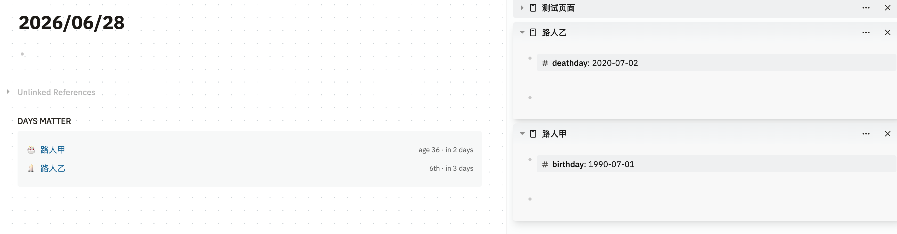

# Days Matter — Logseq plugin

Show birthday / anniversary / countdown reminders **from page properties** in your
Logseq journal. Add a date property to a page and it surfaces automatically — no
`SCHEDULED` markers, no per-page setup.

> **File-based (Markdown) graphs only.** This plugin reads page properties via
> the file-graph datascript schema (`:block/properties`, `:block/pre-block?`).
> The newer **database (DB) version** of Logseq uses a different schema and is
> **not supported**.



## What it does

- Reads configured **date page-properties** (default `birthday::`, `deathday::`) — only from a page's first/properties block, not from ordinary blocks.
- Computes the **next occurrence** (rolling yearly/monthly/weekly, or a one-off countdown) and the age / Nth anniversary / days-since.
- Auto-injects a **"Days Matter" section in the journal view** (styled to match the native "Scheduled and deadline" block), listing entries inside each type's lead window.

## Usage

On any page (e.g. a person's page), add a property in the **first block** (the
page-properties block):

```
birthday:: 1990-01-01
```

> Only **page properties** (those in a page's first block) are read. A
> `birthday::` placed on an ordinary block further down the page is ignored.

Both forms work:

- ISO: `birthday:: 1990-01-01` (or `--01-01` when the year is unknown)
- Date page ref: `birthday:: [[1990-01-01 Monday]]` (parsed via your *preferred date format*)

That's it — open today's journal and the section appears when the date is within the lead window.

Optional: drop `{{renderer :days-matter}}` in any block to render the same list there.

## Configuration

Open **Settings → Plugins → Days Matter**. The panel has native controls for the
two built-in types — **Birthday** and **Death anniversary** — each with:

- **Enabled** (toggle)
- **Icon** (emoji)
- **Recurrence** — `yearly` / `monthly` / `weekly` / `none`
- **Lead days** — days before to start showing
- **Show** — `age` / `ordinal` / `daysUntil` / `daysSince` / `none`

## Develop

```bash
npm install
npm test          # unit tests for the pure date logic
npm run build     # type-check + bundle to dist/
```

Load in Logseq: enable Developer mode → **Load unpacked plugin** → select this folder
(after `npm run build`, since `main` is `dist/index.html`).

## Releasing

Releases are automated. Bumping the `version` in `package.json` and pushing to
`master` triggers the [release workflow](.github/workflows/release.yml), which
tags `vX.Y.Z`, builds, and publishes a marketplace-ready GitHub Release with the
packaged zip attached. No manual `git tag` is needed.

```bash
# 1. bump "version" in package.json (e.g. 0.0.2 -> 0.0.3)
# 2. commit and push to master
git commit -am "release: v0.0.3"
git push
```

Pushes that don't change the version are a no-op (the tag already exists). The
Logseq marketplace tracks the latest GitHub Release automatically, so a new
release reaches users without touching the marketplace repo again.

## License

[MIT](./LICENSE) © 2026 Zhizhen He
